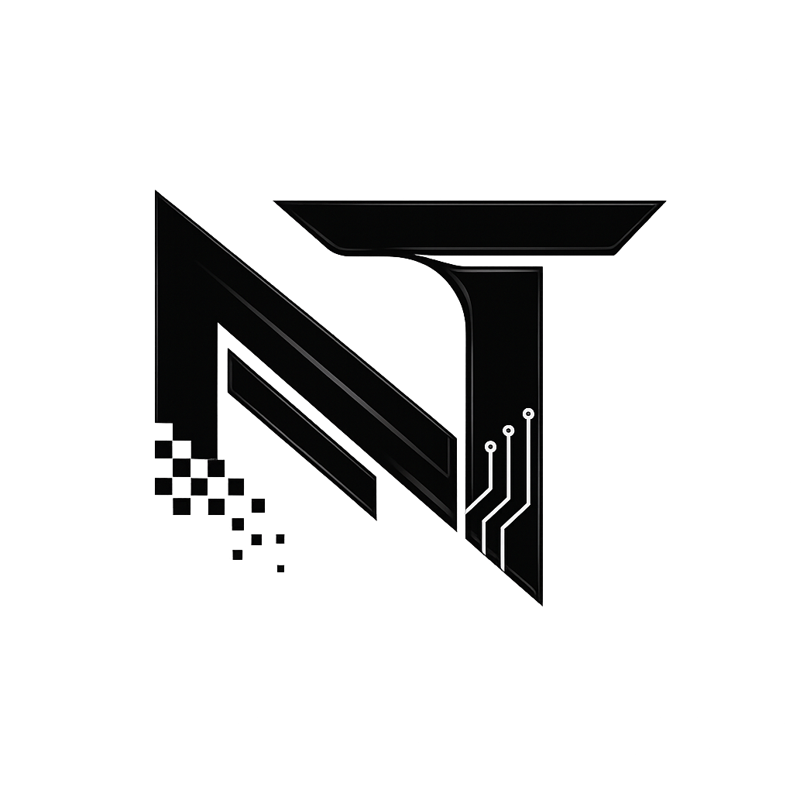
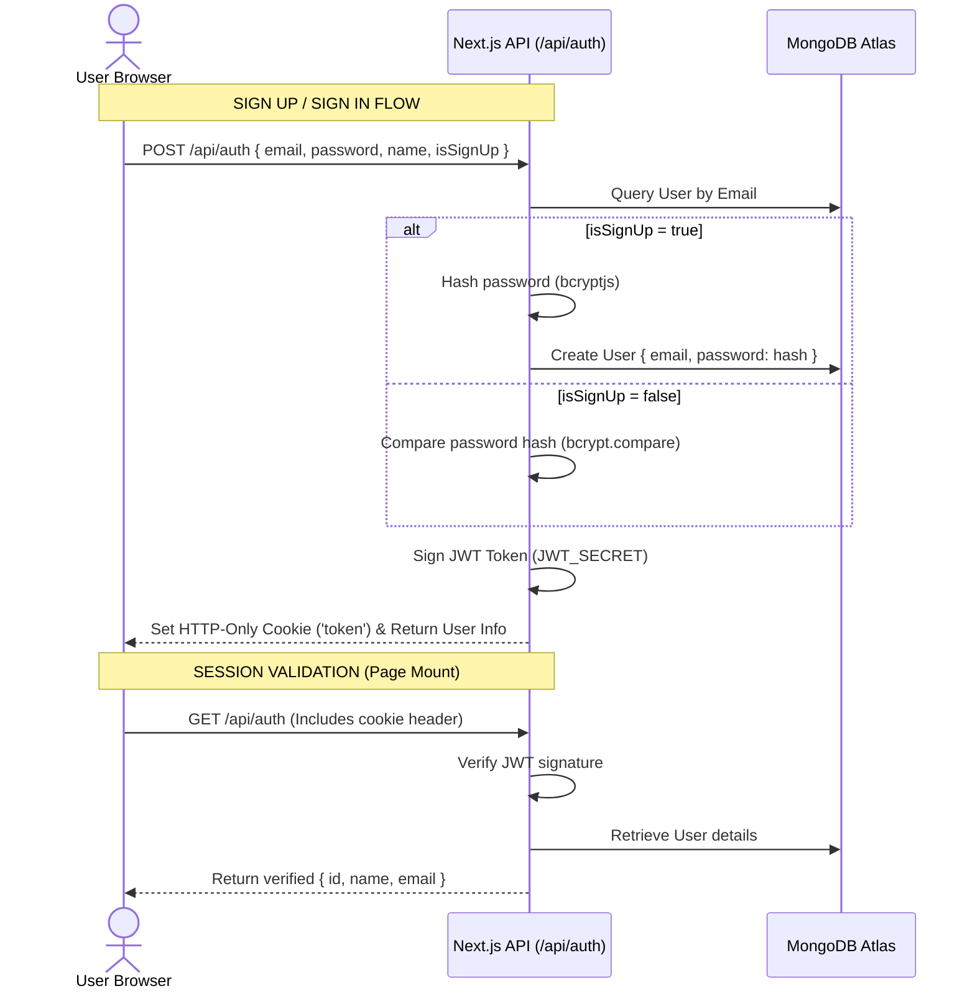

#  Nebuloid Tech Studio LLP — AI Content Studio

A premium, state-of-the-art full-stack AI content generation workspace built with **Next.js**, **JavaScript**, **Tailwind CSS**, **Prisma ORM**, **MongoDB Atlas**, and **Google Gemini AI**. 

This dashboard is designed to help creators generate, optimize, organize, and export high-quality written content (Blog Posts, Social Media Captions, Emails, Marketing Ads, and Product Descriptions) across professional, witty, casual, informative, or persuasive tones.

---

## 🎨 Design & Interface Highlights

* **Modern Glassmorphic UI**: Beautiful translucency, smooth gradients, customized responsive layouts, and floating animation transitions.
* **Light / Dark Mode**: Custom theme manager toggling classes and matching system preferences via `next-themes`.
* **Sidebar Layout & Custom Branding**: Fully customized sidebar containing categorized navigation links, active menu states, helper blocks, and personalized Nebuloid Tech Studio logo branding.
* **Responsive Layouts**: Fixed left sidebar for desktops that transforms into a sliding drawer on mobile viewports via a top navbar hamburger trigger.

---

## 🛠️ Technology Stack

### Frontend Core
* **Next.js 16 (App Router)**: Hybrid client/server framework with optimized routing.
* **React 19 & JavaScript (ES6+)**: Component layer without typescript overhead.
* **Tailwind CSS v4**: Utility-first styling with modern variables and micro-animations.
* **React Hook Form & Zod**: Form state controls with schema validation.
* **Axios**: Promised-based HTTP request client for REST API operations.
* **Lucide React**: Clean vector iconography.

### Secure Backend API
* **Next.js Route Handlers**: Secure serverless API endpoints.
* **BCryptJS & JSON Web Tokens (JWT)**: Secure user password hashing and token encryption.
* **HTTP-Only Cookies**: JWT token stored inside HTTP-only cookies (`lax` state) for secure browser sessions.
* **Prisma ORM**: Modern database access layer with connection caching.
* **MongoDB Atlas**: Fully-managed cloud database serving user and document schemas.

### AI Generative Engine
* **Google Gemini AI SDK**: Connected to the `gemini-2.5-flash` model.
* **Mock AI Engine Fallback**: Context-aware generator. If `GEMINI_API_KEY` is not provided, the application simulates realistic, structured outputs matching the selected tone, topic, and type, maintaining full functionality during evaluation.

---

## 🔐 Security & Session Architecture



---

## 📁 Project Structure

```text
├── app/                  # Next.js App Router (Pages and API Routes)
│   ├── (auth)/login      # Login Page View with toggleable Sign In / Sign Up modes
│   ├── dashboard/        # Main Dashboard Page View (Split layout workspace)
│   ├── api/
│   │   ├── auth/         # POST (login/register), GET (verify session), DELETE (logout)
│   │   ├── generate/     # POST (AI Generative engine controller)
│   │   ├── history/      # GET (retrieve history feed), DELETE (remove generation)
│   │   └── save/         # POST (store content document in database)
│   ├── icon.png          # [NEW] Custom website favicon (public/logo.png map)
│   ├── globals.css       # Core Tailwind variables & transitions styling
│   └── layout.js         # Root HTML layout and Context Providers wrap
├── components/           # Reusable View Components
│   ├── Sidebar.js        # Left navigation panel with upgraded plan callouts
│   ├── Navbar.js         # Navigation header showing user context & center branding
│   ├── ThemeProvider.js  # Theme Context wrapper (Light/Dark themes)
│   ├── DashboardForm.js  # Input parameters (Type card grid, Tone badges, Topic text)
│   ├── ResultDisplay.js  # Markdown output previewer, Save triggers, format Exporters
│   └── HistoryList.js    # Generation log grid table with type/search filters & pagination
├── lib/
│   └── prisma.js         # Prisma client connection cache and Mock DB Fallback Proxy
├── services/
│   └── ai.js             # Google Gemini API AI generator & Mock prompt fallback
├── store/
│   └── auth-context.js   # Client Session Context (login, logout, startup check)
├── prisma/
│   └── schema.prisma     # MongoDB models & attributes declarations
├── jsconfig.json         # Module path aliases mappings (`@/*`)
├── .env.example          # Environment variables documentation template
└── .env.local            # Secret keys (MongoDB Atlas URL, Gemini key, JWT Secret)
```

---

## 🗄️ Database Schemas

### User Model
Stored in the `User` collection:
| Field | Type | Attributes | Description |
| :--- | :--- | :--- | :--- |
| `id` | String | `@id` `@default(auto())` `@db.ObjectId` | MongoDB primary ID |
| `name` | String | | Profile name |
| `email` | String | `@unique` | Login email address |
| `password` | String | | Encrypted password (bcrypt hash) |
| `createdAt` | DateTime | `@default(now())` | Registration date |

### Content Model
Stored in the `Content` collection:
| Field | Type | Attributes | Description |
| :--- | :--- | :--- | :--- |
| `id` | String | `@id` `@default(auto())` `@db.ObjectId` | Primary Key ID |
| `userId` | String | `@db.ObjectId` | Owner reference key |
| `contentType` | String | | E.g. Blog Post, Social Media Post |
| `topic` | String | | Dynamic topic keywords |
| `tone` | String | | E.g. Professional, Casual |
| `prompt` | String | | Detailed prompt sent to Gemini |
| `output` | String | | Generated output markdown string |
| `createdAt` | DateTime | `@default(now())` | Stored timestamp |

---

## 🔌 API Documentation

### 🔑 Authentication (`/api/auth`)

#### 1. Login / Sign Up (`POST`)
- **Body**:
  ```json
  {
    "email": "krishan@gmail.com",
    "password": "securepassword123",
    "name": "Krishan Chamoli", // Required only if isSignUp is true
    "isSignUp": false // Set true for registration
  }
  ```
- **Response** (`200 OK`): Sets HTTP-only `token` cookie.
  ```json
  {
    "success": true,
    "user": {
      "id": "60d5ec4b1234567890abcdef",
      "name": "Krishan Chamoli",
      "email": "krishan@gmail.com"
    }
  }
  ```

#### 2. Verify Session (`GET`)
- **Headers**: Automatically includes browser session cookie.
- **Response** (`200 OK`):
  ```json
  {
    "success": true,
    "user": {
      "id": "60d5ec4b1234567890abcdef",
      "name": "Krishan Chamoli",
      "email": "krishan@gmail.com"
    }
  }
  ```

#### 3. Terminate Session (`DELETE`)
- **Response** (`200 OK`): Clears cookie.
  ```json
  {
    "success": true,
    "message": "Logged out successfully."
  }
  ```

---

### ✍️ Generator & Workspace

#### 4. Generate AI Content (`POST /api/generate`)
- **Body**:
  ```json
  {
    "contentType": "Social Media Post",
    "topic": "Launching new content creator application",
    "tone": "Witty"
  }
  ```
- **Response** (`200 OK`):
  ```json
  {
    "success": true,
    "data": {
      "contentType": "Social Media Post",
      "topic": "Launching new content creator application",
      "tone": "Witty",
      "prompt": "...",
      "output": "...",
      "modelUsed": "gemini-2.5-flash"
    }
  }
  ```

#### 5. Save Generation (`POST /api/save`)
- **Body**:
  ```json
  {
    "userId": "60d5ec4b1234567890abcdef",
    "contentType": "Social Media Post",
    "topic": "...",
    "tone": "...",
    "prompt": "...",
    "output": "..."
  }
  ```
- **Response** (`200 OK`):
  ```json
  {
    "success": true,
    "message": "Content saved successfully",
    "data": { "id": "60d5ec4b1234567890f912e8", ... }
  }
  ```

#### 6. Delete Record (`DELETE /api/history?contentId=<id>`)
- **Response** (`200 OK`):
  ```json
  {
    "success": true,
    "message": "Record deleted successfully."
  }
  ```

---

## ⚙️ Installation & Development Setup

### Prerequisites
* **Node.js**: v18.x or later.
* **MongoDB**: A running MongoDB Atlas URI.

### 1. Clone & Set Up Directory
```bash
git clone <repository-url>
cd ai-content-studio
```

### 2. Install Packages
```bash
npm install
```

### 3. Add Environment Secrets
Create a `.env.local` file inside the root directory:
```bash
cp .env.example .env.local
```

Open `.env.local` and configure your credentials:
```env
# MongoDB Database URL
DATABASE_URL="mongodb+srv://<user>:<password>@<cluster>.mongodb.net/contentstudio?retryWrites=true&w=majority"

# Google Gemini AI Key
GEMINI_API_KEY="AIzaSyYourGeminiAPIKeyHere"

# JWT Signing Secret (For browser session encryption)
JWT_SECRET="nebuloid_super_secret_jwt_key_2025_studio"

# Application URL
NEXT_PUBLIC_APP_URL="http://localhost:3000"
```

### 4. Build & Generate Database Client
Generate the Prisma Client models:
```bash
npx prisma generate
```

Push standard database collection structures to MongoDB Atlas:
```bash
npx prisma db push
```

### 5. Launch Development Workspace
```bash
npm run dev
```
Open **[http://localhost:3000](http://localhost:3000)** inside your browser to access the dashboard.
